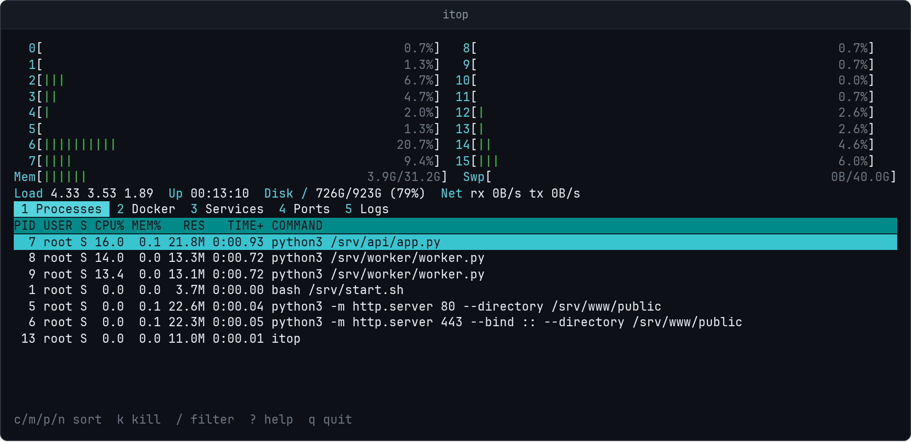
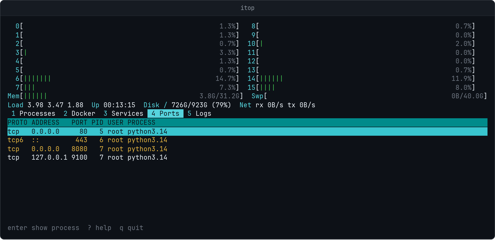
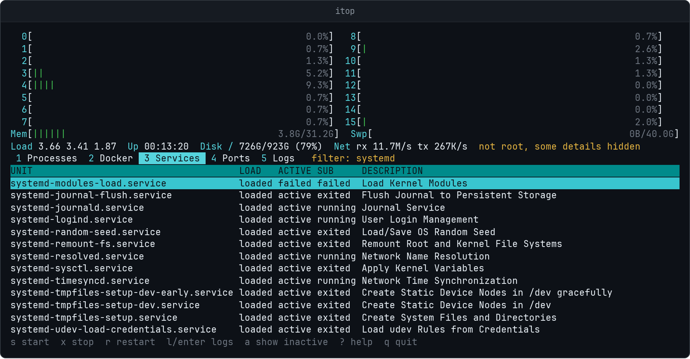

<p align="center"></p>

<p align="center">
  
  
  <a href="https://github.com/instantnodeeu/itop/releases"></a>
  <a href="https://github.com/instantnodeeu/itop/stargazers"></a>
  <a href="https://github.com/instantnodeeu/itop/actions"></a>
  <a href="https://instantnode.eu"></a>
</p>

A terminal system monitor for Linux servers. It is htop with the stuff I
kept opening in other panes bolted on: Docker containers, systemd services,
listening ports and logs, all in one window.

- **Processes** with CPU, memory, sorting, filtering and kill
- **Docker** containers with live CPU/memory, start/stop/restart and logs
- **Services** from systemd, failed units on top, restart and journal
- **Ports** that are listening, which process owns them, and whether they
  are bound to something other than loopback
- **Logs** follows the journal, a unit, or a container

The header shows per core CPU, memory, swap, load, uptime, root disk and
network throughput.

It reads `/proc` directly, talks to the Docker socket over plain HTTP and
shells out to `systemctl`/`journalctl`. No agent, no config file, one static
binary. If Docker or systemd is missing the tab just says so.



<details>
<summary>Ports and services</summary>




</details>

## Install

```sh
curl -fsSL https://raw.githubusercontent.com/instantnodeeu/itop/main/install.sh | sudo sh
```

This puts the latest release in `/usr/local/bin` after checking its sha256. Without
`sudo` it goes to `~/.local/bin`. Run the same line again to update,
`VERSION=v0.1.0` pins a release, `BINDIR` picks another directory. The binaries
are also on the [releases](https://github.com/instantnodeeu/itop/releases) page.

Or with Go 1.24+:

```sh
go install github.com/instantnodeeu/itop@latest
```

## Usage

```sh
itop          # refresh every 2s
itop -d 1s    # faster
sudo itop     # see every process's ports and all journal entries
```

Running without root works fine. You just won't see which process owns
sockets of other users, and service actions will fail unless polkit allows
them. Docker needs your user in the `docker` group.

## Keys

| Key | |
|---|---|
| `1`-`5`, `Tab` | switch tab |
| `/` | filter the current tab, `Esc` clears |
| `?` | help |
| `q`, `F10` | quit |

Processes: `c` `m` `p` `n` sort by CPU, memory, PID, name (press again to
reverse), `k` or `F9` to send TERM/KILL.

Docker and Services: `s` start, `x` stop, `r` restart, `l` or `Enter` to
follow logs. `a` toggles inactive services.

Ports: `Enter` jumps to the owning process.

Logs: `g`/`G` top and end, `s` goes back to the system log.

## Building

```sh
make          # ./itop
make test
make dist     # static amd64 and arm64 binaries in dist/
```

## License

MIT
